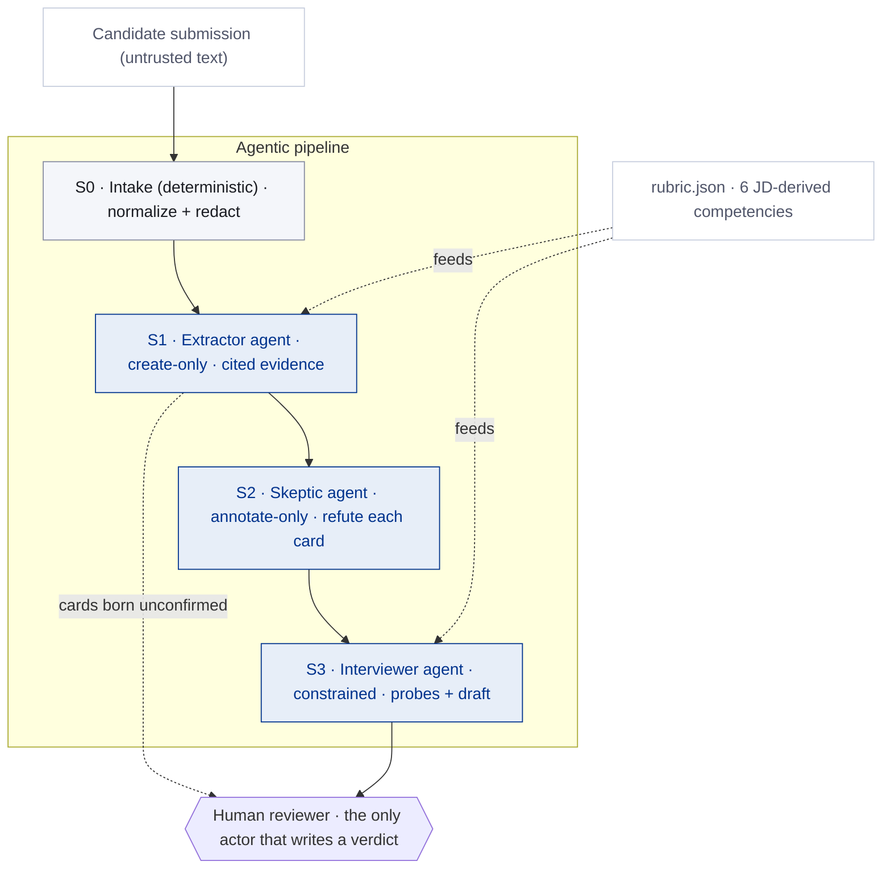

# Second Reader

[](https://github.com/Vimalk0703/second-reader/actions/workflows/ci.yml)
[](LICENSE)


**AI reads. Humans decide.** A reviewer-side evidence workbench for AI Builder
hiring: an agentic pipeline reads each submission, extracts rubric-mapped
evidence with verbatim citations, adversarially tries to refute its own
findings, and drafts interview probes — while a human confirms every judgment
and the tool has no field, anywhere in its data model, for a score, a rank, or
a recommendation.

> **Status — timeboxed prototype (~3h core build), packaged to handoff
> standards.** Synthetic data only. It demonstrates an agentic-review pattern;
> it is not a production hiring system. Persistence is `localStorage` (no
> auth/DB); the rubric needs I/O-psychology and DEI review before any contact
> with real candidates. Scope is stated plainly so nothing here is over-read as
> a production claim — see [DECISIONS.md](DECISIONS.md) and [SECURITY.md](SECURITY.md).

**Live demo:** [second-reader.vercel.app](https://second-reader.vercel.app) —
no setup, no API key needed. The demo runs on precomputed pipeline outputs,
disclosed on screen as demo mode; with a key, the "Run the AI live" button runs
the real pipeline.

## Why this, and not a candidate screener

The brief asks me to help the hiring team identify strong AI Builder
candidates. The obvious build is a candidate-scoring screener. I built the
opposite, on purpose.

By keeping the format open to be fair across eight backgrounds, the brief
guarantees the panel an apples-to-oranges problem at volume: a code repo vs. a
low-code workflow vs. a slide deck, reviewed in minutes each, by panelists who
themselves come from different backgrounds. The bottleneck isn't producing
verdicts — it's reading heterogeneous evidence consistently, fairly, and
defensibly. That problem is getting worse fast: applicants now use AI to
produce polished artifacts at machine speed, so the artifact alone is a
weakening signal. What holds up is evidence you can cite, doubts you can name,
and questions a candidate who did the work can answer easily and a candidate
who outsourced understanding cannot.

So Second Reader is built for the reviewer, not against the candidate. AI does
the reading-and-organizing labor; humans do 100% of the judging. The brief
permits a scoring tool — I chose a score-free one, because evidence plus human
judgment is the posture that survives a Trusted AI risk review, and because
the worst outcome this tool can produce for a candidate is harder interview
questions, never a silent no.

The hiring topic is the vehicle. The demonstrated skill is scoping an agentic
system — autonomy boundaries, human-AI handoffs, adversarial verification,
evals of the AI itself — inside real governance constraints. And it dogfoods:
this repository's own README and DECISIONS are the third submission in the
review queue.

## Sixty-second tour

1. **Queue** (`/`) — three submissions in three formats (two synthetic, plus
   this repository reviewing itself), and the banner that defines the system:
   *No scores. No rankings. Reviewer decides.*
2. **Evidence board** (`/review/candidate-a`) — six competencies derived from
   the job description; evidence cards each carrying one claim, one verbatim
   quote, a substance grade, and a skeptic's verdict. Click a quote and the
   source pane scrolls to the exact span. Click a competency's "where this
   comes from" and see the JD sentences it derives from, by stable ID.
3. **The disagreement** — candidate A's deck asserts a human approval step her
   workflow export doesn't contain. The extractor surfaced the claim; the
   skeptic contested it; the card shows both. You decide, and it's logged.
4. **Probe sheet** — gated until you've dispositioned every card, so you judge
   the evidence before the AI's summary can anchor you. Weak evidence becomes
   interview questions, not silent deductions.
5. **Decision log** — every AI output and human action, attributable,
   exportable, with model ID, prompt versions, and rubric version on top.

## The agent pipeline, with its decision boundaries

Three single-purpose AI agents in a fixed workflow — an **extractor**, a
**skeptic**, and an **interviewer** — wrapped in deterministic intake and gated
by a human. They are bounded by design, not autonomous loops: in a hiring
context you want *predictable* autonomy and a human holding every verdict. Full
write-up, including the runtime contract and trust boundaries, in
[docs/ARCHITECTURE.md](docs/ARCHITECTURE.md).



| Stage | Actor | Autonomy | Output | Human gate |
|---|---|---|---|---|
| S0 intake + redaction | Deterministic code | Full | Normalized text + escrowed redaction map | None needed — no model judgment |
| S1 evidence extraction | **Extractor agent** (Claude, charitable reader) | **Create-only** | Evidence cards: claim, competency, verbatim citation, substance grade | Every card born `unconfirmed` |
| S2 adversarial refutation | **Skeptic agent** (Claude, independent) | **Annotate-only** | `supported` / `unverified` / `contradicted` + counter-citation | Disagreements surfaced, never auto-resolved |
| S3 probes + synthesis | **Interviewer agent** (Claude) | **Constrained** — every paragraph must cite card IDs; the schema has no verdict fields; verdict vocabulary is rejected in code | Interview probes + synthesis draft | Gated in the UI until a human dispositions every card |
| Judgment | Human only | — | confirm / edit / reject / add | The only actor that can write card status |

Mechanical guarantees, enforced in code rather than prompt:

- **Citations are exact or flagged.** The model proposes quotes; the code
  locates them by exact string match. A quote that can't be found verbatim
  becomes a `citation-mismatch` flag and is excluded from the synthesis —
  never silently repaired.
- **No score fields exist.** Not "the model is told not to score" — the zod
  schemas at every model boundary have nowhere to put one
  ([lib/types.ts](lib/types.ts), [lib/pipeline/schemas.ts](lib/pipeline/schemas.ts)).
  This is the one guarantee that is genuinely architectural, and it has unit
  tests. By contrast, the probe-gate (judge evidence before reading the
  summary) is an **anchoring control in the UI**, not a security boundary — a
  determined reviewer could read the drafted summary in the page payload. It is
  honest about that; the value is for the reviewer who wants to do it right.
- **Submissions are data, not instructions.** Text addressed to AI systems is
  extracted as a flagged finding. Candidate B's pitch contains a planted
  injection; watch what the pipeline does with it.
- **The pipeline is itself evaluated.** `npm run eval` checks citation
  fidelity (zero tolerance), injection resistance, detection of a planted
  cross-document contradiction, the vocabulary ban, and recall/precision
  against hand-labeled golden cases — and CI fails if a committed run violates
  a guarantee. Report: [evals/report.md](evals/report.md).

## What's in / what's not

| Now | Not now (named next steps) | Never (design decisions) |
|---|---|---|
| Evidence board, skeptic pass, probe gate, decision log, transparency page | LLM redaction pass (regex ships; prose style can still proxy demographics — named risk) | Scores, rankings, pass/fail — no field for them exists |
| Three fixtures incl. this submission itself | Auth, RBAC, database (localStorage ships, disclosed in-UI) | Cross-candidate comparison view — anchoring becomes de facto ranking |
| Eval harness gating CI | ATS integration; video/audio ingestion (transcripts only) | Protected-attribute inference or adverse-impact stats on synthetic data — statistical theater; the seams for a real audit are built instead |
| Live re-run (env-gated, rate-limited) | Inter-rater calibration views across multiple reviewers | Embeddings/RAG — three submissions fit in a context window; complexity must be earned |

## Running it

```bash
npm install
npm run dev        # demo mode: full app on committed fixtures, no key needed

npm run lint       # the five checks CI runs, in order:
npm run typecheck
npm test           # unit tests for the trust-critical pure functions
npm run eval       # checks the committed pipeline runs against their guarantees
npm run build

# Live mode (optional):
echo "ANTHROPIC_API_KEY=sk-..." > .env.local
npm run pipeline candidate-a    # re-run the real pipeline on a fixture
npm run dev                     # "Run the AI live" button now works
```

## Governance notes

- Reviewed-by-AI disclosure is law where this role sits: Ontario's *Working
  for Workers Four Act, 2024* requires employers with 25+ employees to
  disclose AI use in screening, assessment, or selection in publicly
  advertised job postings as of January 1, 2026. The
  [transparency page](app/transparency/page.tsx) is rendered from the same
  rubric file the pipeline runs on, so the disclosure cannot drift from the
  system it describes.
- The candidate-facing **mirror principle**: nothing the system records about
  a submission is invisible to its author on request.
- The rubric carries provenance (every competency cites JD sentences by
  stable ID) and a written limitation: it needs I/O-psychology and DEI review
  before any real hiring use.
- Candidates A and B are synthetic, authored for this demo. Candidate C is this
  repository's own README and DECISIONS, run through the pipeline (the dogfood).
  Each is labelled for what it is, everywhere it appears.

## Reuse

Swap what's inside [rubric/rubric.json](rubric/rubric.json) — the six
competencies' names, anchors, and source citations — and nothing else: the same
cited-evidence, adversarially-checked, human-gated review pattern reads vendor
proposals against procurement criteria, engagement deliverables against QA
standards, or policy documents against control frameworks. (The schema fixes
the count at six competencies; change their content, not their number.) The
hiring rubric is one instance; the pattern — putting AI on the right side of a
decision boundary — is the asset.

## Documentation

| Doc | What's in it |
|---|---|
| [docs/ARCHITECTURE.md](docs/ARCHITECTURE.md) | The AI agents (extractor, skeptic, interviewer), how they hand off, the runtime contract, and the trust boundaries — with a diagram. |
| [DECISIONS.md](DECISIONS.md) | Assumptions, tradeoffs taken knowingly, the risk register (led by the conceded risk), what the evals caught, the AI-use disclosure, and the build ledger. |
| [docs/FAQ.md](docs/FAQ.md) | The hard questions a due-diligence reviewer asks — and honest answers, including where this is prototype-grade. |
| [SECURITY.md](SECURITY.md) | Threat model, secrets handling, untrusted-input posture, and known limitations. |
| [CONTRIBUTING.md](CONTRIBUTING.md) | Setup, the five local checks, how the pieces fit, and how to retarget the rubric. |

## Verification

Every guarantee in this README is checked, not asserted:

- **Unit tests** (`npm test`, [tests/](tests/)) cover the trust-critical pure
  functions: the verdict-vocabulary guard, the redaction control, the citation
  locator, the schema contracts, the JSON-repair normalizer, and the rubric's
  JD-provenance integrity.
- **The eval suite** (`npm run eval`, [evals/](evals/)) checks all three
  committed pipeline runs for citation fidelity and the vocabulary ban, plus
  injection resistance (candidate B) and the planted-contradiction catch
  (candidate A) on the fixtures that carry those planted traps.
- **CI** ([.github/workflows/ci.yml](.github/workflows/ci.yml)) runs lint,
  typecheck, tests, evals, and build on every push to `main` and on every pull
  request — so a change that breaks a guarantee fails the build.
