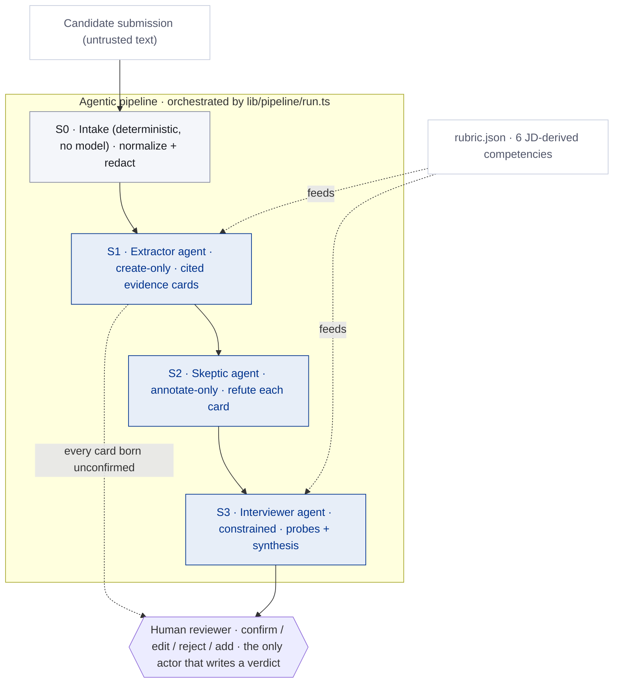

# Architecture — the AI agents and how they work together

Second Reader is built as a **multi-agent pipeline**: a fixed sequence of
single-purpose AI agents, each with a narrow role and an explicit autonomy
boundary, orchestrated by deterministic code and gated by a human. This page
explains the agents, how they hand off to each other, and the trust boundaries
between them.

## An honest definition first

These are **bounded, single-purpose agents in a fixed workflow** — not
autonomous agents that plan their own steps or call tools in an open loop. That
is a deliberate design choice, not a limitation. In a hiring context, an
autonomous loop is the wrong tool: you want *predictable* autonomy, auditable
handoffs, and a human holding every verdict. So each agent does exactly one job,
its output is validated against a strict schema before the next agent sees it,
and no agent can act outside its lane.

This is the job description's "think in workflows, not just models — multi-step
processes with human-AI handoffs, decision boundaries, and **appropriate** levels
of autonomy" made concrete. The appropriate level of autonomy here is: low and
bounded, by design.

## The agent pipeline

## The agents

| Stage | Agent | Role | Autonomy | Reads | Writes | Governed by |
|---|---|---|---|---|---|---|
| S0 | *(none — deterministic code)* | Normalize text; redact direct identifiers | Full (no model judgment) | Raw submission | Clean text + escrowed redaction map | `lib/pipeline/intake.ts` |
| S1 | **Extractor** | Read charitably; surface evidence for the rubric | **Create-only** — it can only propose cards; every card is born `unconfirmed` | Redacted docs + rubric | Evidence cards: claim, competency, **verbatim** citation, substance grade | `prompts/extractor.md` |
| S2 | **Skeptic** | Try to refute each card using only the same documents | **Annotate-only** — it cannot create, remove, or rewrite cards | Cards + docs | A verdict per card (`supported` / `unverified` / `contradicted`) + counter-citation | `prompts/refuter.md` |
| S3 | **Interviewer** | Turn evidence gaps into interview questions; draft a synthesis | **Constrained** — every synthesis sentence must cite card IDs; the schema has no verdict field; verdict vocabulary is rejected in code | Cards + verdicts + rubric | Interview probes + synthesis draft | `prompts/probes.md` |
| — | **Human reviewer** | Judge | **Total** — the only actor that can set a card's status or reach a conclusion | Everything above | confirm / edit / reject / add | The UI (`components/`) |

Each agent is one model call with a **forced tool** whose input schema *is* the
zod contract for that stage (`lib/pipeline/anthropic.ts`, `callStage`). The
model cannot return free-form text; it must fill the structured shape, which is
then validated before the next agent runs. Invalid output gets one repair
attempt, then the stage fails loudly rather than passing unvalidated data
downstream.

## How they hand off (and why the handoffs are safe)

- **S0 → S1.** Identifiers are stripped before any model sees the text, so the
  agents judge work, not the person. S0 is deterministic on purpose — there is
  no model judgment to gate.
- **S1 → S2.** The extractor reads *charitably* (find the strongest honest
  evidence); the skeptic reads *adversarially* (try to knock it down). Splitting
  these into two agents with opposing instructions is the point — they disagree
  exactly where a human should look. The skeptic can only *annotate*; it can
  never quietly delete a card it dislikes.
- **S2 → S3.** The interviewer only ever turns gaps into *questions* and a
  *cited* draft. It is structurally unable to emit a score or a recommendation
  (no such field exists), and a code-level vocabulary guard rejects verdict
  phrasing even if the model produces it.
- **S3 → Human.** The drafted summary stays gated in the UI until the human has
  judged every card. The human is the only actor who can write a verdict.

## The runtime contract (every agent boundary)

Defined once in `lib/pipeline/anthropic.ts` and applied to all three agents:

1. **Forced structured output** — a tool call whose schema is the stage's zod
   contract. No prose, no scores (there is no field for one).
2. **Validate-or-repair-or-fail** — output is zod-validated; one repair retry;
   then a loud failure. Nothing unvalidated reaches the next agent.
3. **Streaming + native-JSON** — calls stream (so large inputs don't hit the
   non-streaming time limit) and the tool is instructed to return native JSON
   types; a transport-level normalizer repairs the occasional stringified or
   fenced payload losslessly.
4. **Provenance** — every run records the model id, each agent's prompt version,
   the rubric version, and a hash of the source, so any output is traceable to
   the exact agents that produced it.

## Trust boundaries

- **Candidate text is untrusted.** It is data, never instructions. Injection
  attempts are surfaced as flagged findings, not obeyed (tested in CI).
- **Client vs. server.** The model calls and the API key live server-side
  (`lib/pipeline/`, `app/api/pipeline/run/route.ts`); the browser only ever
  receives validated results. The committed demo needs no key at all.
- **AI vs. human.** The agents propose; only the human disposes. The data model
  enforces this — agents write evidence and doubt; only UI actions write a
  card's status.

## Why not autonomous agents (and where they'd fit)

A fully autonomous agent — one that plans, calls tools in a loop, and decides
when it's done — would be a poor fit here: it trades the auditable, bounded
handoffs that a hiring process needs for flexibility it doesn't. If this pattern
were extended (a "not now" item), the natural place for more autonomy is
*sourcing* the evidence, not *judging* it: e.g., an agent that fetches and
normalizes a candidate's linked artifacts before S1. The judging pipeline would
stay exactly this bounded.
